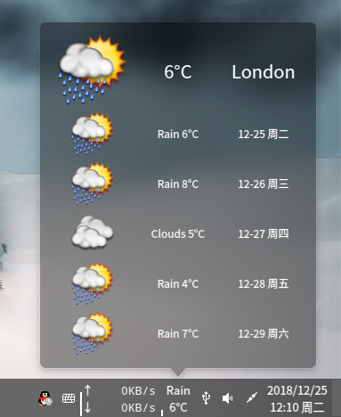
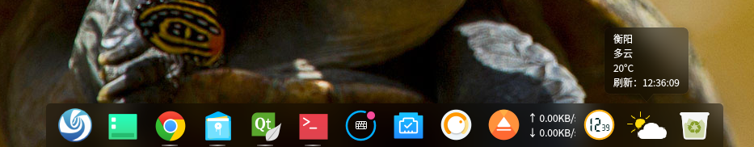
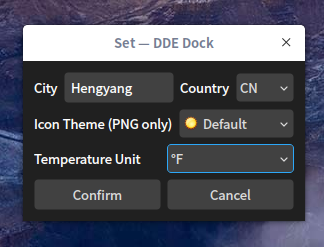
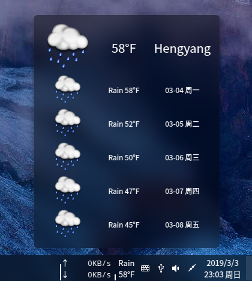
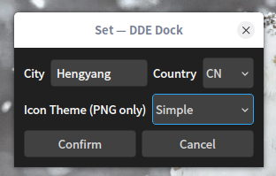

# DDE_Dock_Weather
Deepin Linux DDE-Dock weather forcast plugin.  
[Releases](../../releases/)  
install：./install.sh  
uninstall：./uninstall.sh  
### Build Dependences
Debian: `apt install dde-dock-dev qt5-default libdtkwidget-dev`

  
  

### Problem
Project ERROR: dtkwidget development package not found
`apt-get install libdtkwidget-dev`

### Icon Name Rule

| Weather | Day | Night | Image |
| :-----: | :-: | :---: | :---: |
| Clear | 01d.png | 01n.png |  |
| Clouds | 02d.png | 02n.png |  |
| Clouds | 04d.png | 04n.png |  |
| Clouds | 04d.png | 04n.png |  |
| Rain | 09d.png | 09n.png |  |
| Rain | 10d.png | 10n.png |  |
| Thunder | 11d.png | 11n.png |  |
| Snow | 13d.png | 13n.png|  |
| Fog | 50d.png | 50n.png |  |
| NA | na.png | na.png |  |

#### Because the night time is not very accurate, we use the same icon for day and night.
### 5.4 (2019-03-03)
Add temperature unit set:  

### 5.3 (2019-01-07)
* Support icon theme  

### 5.0 (2018-12-19)
* Change API to https://openweathermap.org to support world wide weather forcast.